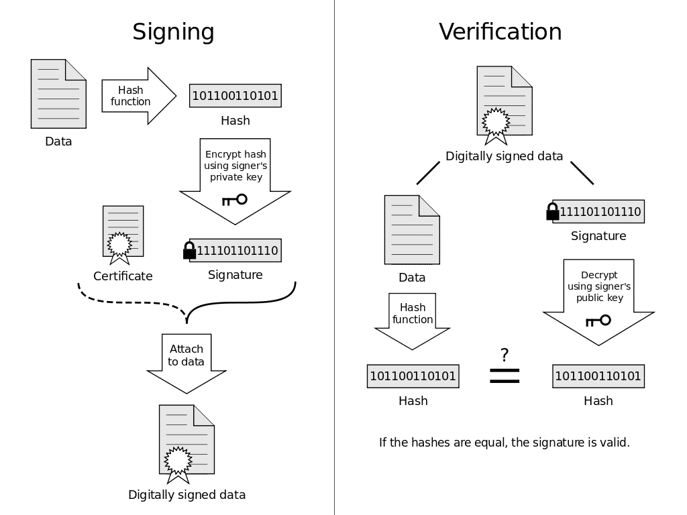
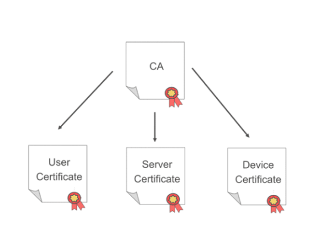
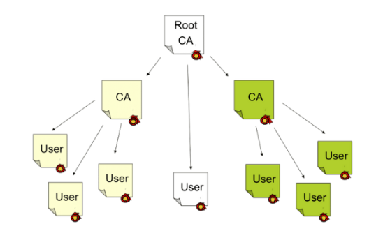
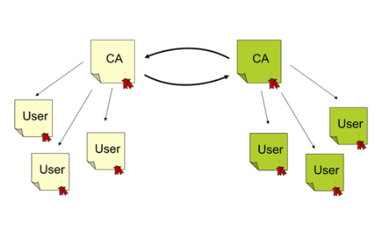
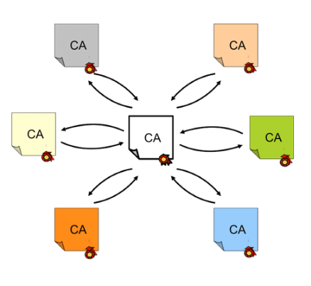

# Week 6
## Week 6 - Introduction to Cryptography - Cryptography Lectures slides 12 to 20
Link: https://learning.edx.org/course/course-v1:NYUx+CYB.ISP.2+3T2020/block-v1:NYUx+CYB.ISP.2+3T2020+type@sequential+block@07a8aed3b2434f4794c993e035bdacf8/block-v1:NYUx+CYB.ISP.2+3T2020+type@vertical+block@3b0d14f2ee6a4b179f52a541c908043e

### Cryptographic Hashes
- (Grote) hoeveelheid data omzetten in **fixed-length** value waarbij **geen info** kan worden gevonden over de inhoud van de data
- Vereisten:
    - Input kan gelijk welke lengte hebben
    - Ouput heeft vaste lengte
    - Relatief makkelijk en snel te berekenen
    - Altijd zelfde output voor zelfde input
    - One-wayness
    - Weak-collision resistance
    - Strong-collision resistance

*Collision = 2 input met dezelfde hash*

**One-wayness**: gegeven h(x), onhaalbaar x te vinden

**Weak-collision resistance**: gegeven x, onhaalbaar y te vinden waarbij h(x) = h(y)

**Strong-collision resistance**: onhaalbaar paar x en y te vinden waarbij h(x) = h(y)

**Birthday paradox**: botsing kan gevonden worden in 2^(n/2) pogingen voor een hash van n bits lang.

Collision zal altijd te vinden zijn wanneer input groter is dan ouput, moet alleen zeer moeilijk te vinden zijn.

### Hash Functions and Digital Signatures
- Hashes kunnen probleem van **te grote input** bij Digital Signatures oplossen
- **Hash van data** zal worden gesigned **i.p.v. de data zelf** (sneller, efficiënter)

1. Bereken hash van message: `h = H(m)`
2. Signeer hash: `S = Enc(Kpriv, h)`
3. Verstuur message en signed hash
4. Ontvanger decrypteert hash `h = Dec(Kpub, S)`
5. Ontvanger berekent hash van message `h2 = H(m)`
6. Vergelijk hashes `h = h2?`

=> Dit garandeert dat een message van die persoon komt en niet aangepast werd onderweg.

### Public Key Infrastructures (PKI)
- PKI garandeert dat public key van die persoon is
- Gebeurt aan de hand van een vertrouwde server (**Certificate Authority**) die certificaten uitdeelt

### Digital Certificates
- Is fundamenteel onderdeel van PKI
- Bewijst **eigenaarschap van public key**
- Bestaat o.a. uit:
    - Info over de key (bv serial number)
    - Info over de eigenaar (subject)
    - Digital signature van Certificate Authority die dit alles bevestigd (issuer)

### PKI Structure
- Verschillende (complexe) structuren mogelijk
- User volgt steeds **Chain of trust**. Blijft issuers controleren tot vertrouwde root CA of er geen issuers meer overblijven (=> geen vertrouwen)

1. **Hierarchy**

2. **Multi-level hierarchy**

3. **Cross-certify hierarchies** (simpeler alternatief is CA bridge)

### PKI: Components
- **Certificate authority**: deelt certificaten uit
- **Registration authority**: verifieert identiteit
- **Certificate repository & Revocation information**: houdt valid en invalid certificaten bij

Registratie hangt af van systeem tot systeem. Vb. LetsEncrypt: code draaien op website is genoeg.

### Revocation
- Invalideren van certificaat (gehackt, niet meer correct, key algoritme niet meer veilig etc)
- Is later toegevoegde functionaliteit, niet perfect
- Gebeurt via **Certificate Revocation Lists** (CRLs) and **Online Certificate Status Protocol** (OCSP)

**Certificate Revocation Lists (CRLs)**
- Blacklist van ingetrokken certificates
- Moet gedownload worden op client
- Lange tijd tussen compromise en blacklisten
- Bevat serial number certificate, revocation time en reason

**Online Certificate Status Protocol (OCSP)**
- Beter techniek, maar zeker niet perfect
- Client vraagt aan server of certificaat ingetrokken is
- Systeem moet altijd online zijn