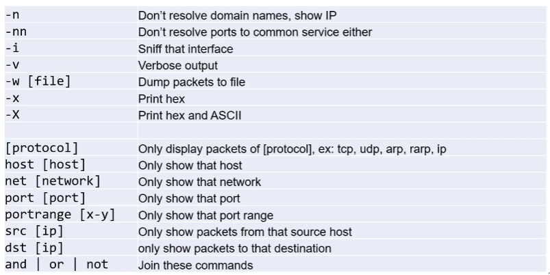

# Cybersecurity Advanced
## Week 2 - How Networks are Attacked - Part I - slides 1-30
Link: [Week 2 - How Networks are Attacked - Part I - slides 1-30](https://learning.edx.org/course/course-v1:NYUx+CYB.NET.1+3T2020/block-v1:NYUx+CYB.NET.1+3T2020+type@sequential+block@9d35edaacc39412cb38d759cfb1732a7/block-v1:NYUx+CYB.NET.1+3T2020+type@vertical+block@12fd005212744f8b9163dcf4ae6051cd)

1. Reconnaissance
2. Scanning
3. Vulnerability Identification
4. Exploitation
5. Post Exploitation

### Reconnaissance
A good reconnaissance phase is going to have a notebook full of information about the target. Here are some examples:
- IP Addresses
- Network Topology Information
- Domain Names
- Account Logins
- Operating Systems & Software
- Security Policies
- Physical Security Systems
- Employee Hangouts

**Google's Advanced Search** tools can be used in some pretty creative ways.
- "site:"
- "link:"
- "intitle:"
- "inurl:"
- "related:"

**Social networks** are a treasure trove for attackers.

**Cree.py** is an open source intelligence gathering application that can automatically gather pictures from social networking platforms and sort geolocation data from those pictures.

**Robtex.com** uses various sources to gather public information about IP numbers, domain names, host names, autonomous systems, routes, etc. It then indexes the data in a big database and provides free access to the data.

**SHODAN** helps you understand your digital footprint. Monitor Network Security and keep track of all the computers on your network that are directly accessible from the Internet.

**Angry IP Scanner** scans addresses and ports in any range and exports results in many formats.

Sometime a host-based firewall is configured to ignore an Internet Control Message Protocol (ICMP) echo request (or ping) and a ping sweep won't work. In this case, we can leverage Domain Name System (DNS), since most external resources are present in the DNS database.

**Dig** (domain information groper) is a tool built into Linux, which is designed to interrogate domain name servers. We can use dig to pretend to be a backup DNS server, perform a zone transfer, and receive entries in the target DNS database. 

*Split DNS* seperate DNS servers for internal en external users

### Scanning

### Vulnerability Identification
- Software bugs
- Bad design
- Misconfiguration software/security

### Exploitation
- Gain access
    - Root access
    - Elevating user permissions
    - DoS

### Post Exploitation
- Exfiltrate data
- Maintain long-term access
- Remove forensic information

## TCPDump
Link: [Week 34 - section 4-3: Scanning with TCPDump](https://learning.edx.org/course/course-v1:NYUx+CYB.PEN.1+1T2021/block-v1:NYUx+CYB.PEN.1+1T2021+type@sequential+block@8541d1ea857a4a3384ce1d1b022f6fcd/block-v1:NYUx+CYB.PEN.1+1T2021+type@vertical+block@01cc90a8cd3448b2919beafd18165570)

- Network sniffing tool
- Niet voor network scanning
- Handig om network traffic te analyseren in combo met scanner
- Op remote machine best SSH excluden

### TCPDump options

