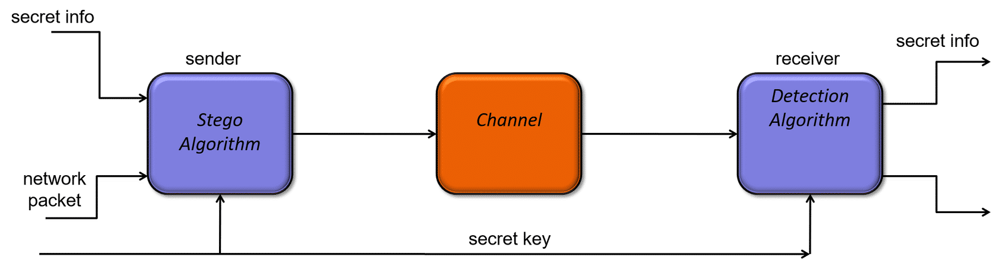

# Week 4
## Week 4 - How Networks are Attacked - Part III (all slides)
Link: https://learning.edx.org/course/course-v1:NYUx+CYB.NET.1+3T2020/block-v1:NYUx+CYB.NET.1+3T2020+type@sequential+block@9304d7b516ed44df97d628f55cb888ba

### Post Exploitation
Na verkrijgen van controle wil attacker:
- **Persistance: Toegang behouden**
- **Verwijderen van forensisch bewijs**
- **(Data) Ex-filtration**

### Persistence – Maintaining Access
Behalve behouden van toegang wordt in deze stage ook het doel van de attack uitgevoerd:
- **Data exfiltration**
- **Data manipulation**
- **Data destruction**

Elke OS heeft eigen manier voor starten van services

Belangrijk om steeds sporen op te kuisen!

### Trojans
- **Niet self-replicating** “back door” program dat **verborgen** draait op een geïnfecteerde computer.
- Vaak de manier waarop attackers de initiële controle krijgen over computer
- Worden gebruikt voor:
    - Stelen data (Hoofdzakelijk, vooral financiële data)
    - Bot worden in botnet (DDoS)
    - Proxy voor attacker
- Installatie methodes:
    - Niet-vertrouwde software download
    - Email bijlage
    - Applicatie level exploits
    - Executable context op websites (Flash, ActiveX)

### Viruses, Worms
- **Virus**: Hangt zich aan een ander programma om zich te voort te planten (zoals menselijk virus)
- **Worm**: Gelijkaardig aan virus, maar is self-replicating. Worm kan zich voortplanten zonder hulp van een mens.
- **Blended Threat**: Combineert aspecten van Trojans, Viruses en Worms
    - Vb. CodeRed (DDOS attack + trojan achterlaten + self-replicating)

### Rootkits
- Meest voorkomend manier om blijvende controle uit te oefenen
- Ontworpen om forensics te ontwijken
- Kan wijzigen hoe code wordt uitgevoerd
- Kan kwaadaardige processen, bestanden, register entries verbergen
- Traditioneel ontworpen om malware te verbergen, niet verhogen van priveleges
- Kan firmware aanpassen
- 2 grote categoriën:
    - **User mode rootkit**: draait op zelfde niveau als normale processen
    - **Kernel mode rootkit**: draait op zelkde niveau als kernel (kan kernel code en drivers aanpassen)

### Lateral Movement
Eens attacker voet aan de grond heeft binnen een netwerk, gaat die vaak opzoek naar een nieuw perspectief. De nieuwe positie kan nieuwe wegen en targets zichtbaar maken. Attacker zit nu in een omgeving met meer privilege/vertrouwen. Vaak nood aan nieuwe reconnaisance.

Na verkrijgen controle zal eerste stap vaak privilege escalation of vinden van andere users zijn.

### Finding Credentials
- Na verkrijgen controle, best computer doorzoeken (source code, geschiedenis etc)
- Credentials zijn quasi nodig voor alles
- Op Windows mimikatz gebruiken om NTLM hashes te extracten uit het geheugen

### Pass the Hash (PtH)
- Methode om authenticeren als gebruiker zonder toegang te hebben tot plaintext wachtwoord van de gebruiker
- Hash van wachtwoord moet wel eerste verkregen worden
- Werkt doordat authenticatie challenge van authenticatie server wachtwoord hash gebruikt i.p.v. plaintext wachtwoord
- Minder evident bij moderne systemen (bv Win 10)

### Obtaining Password Hashes
- Windows slaat hashes op in Security Account Manager (SAM) file (not accessible with OS booted)
- Ook in registry (HKEY_LOCAL_MACHINE\SAM)
- Meterpreter kan eenvoudig hash db dumpen

**Windows Credential Manager**
- Opslag van username, wachtwoorden (Web (Edge) en Windows), certificaten
- User kan normaal enkel aan eigen credentials
- Attacker heeft vaak meer permissies door exploit

### Powershell Empire
**Powershell**
- OS shell voor automation en configuration management (krachtige scripting taal)
- Staat op elke Win machine

**Powershell Empire**
- Framework voor post exploitation via Powershell
- Veilige en flexibele architectuur
- Laat attacker toe snel post exploitation modules te deployen (key logger, mimikatz etc)
- Kan remotely web credentials stelen van Windows Credential Manager

### Pulling Credentials from Memory
- Mimikatz 
- Geen local admin rechten nodig
- Moeilijker bij moderen OS's (bv. Win 10)

### Data Exfiltration
- Tools zoals Meterpreter en Netcat kunnen gebruikt worden om te pivoteren en routen naar andere systemen als:
    - Geen route of connectie beschikbaar is
    - Andere system achter firewall zitten zonder forwarding
    - Services beperkt zijn tot bepaalde sources
    - Enkel bepaalde ports zijn toegestaan

### Exfiltration of Files
Soms kan het nodig zijn te moeten pivoteren om een effectieve command & control session op te zetten met de attacker machine buiten het network.

### Stenography
- Stenografie is de kunst en wetenschap van het **verbergen van gegevens in andere gegevens**
- Is een veelgebruikte methode om gegevens te exfiltreren zonder dat alarm wordt geslagen.
- Enkel sender en receiver weten van bestaan van data

### Covert Channel
**Network Steganography**
- Verstoppen van data in traffic van legitieme communicatie

**Tunneling**: Encapsuleren van ene protocol in een ander.

Legitieme applicaties tunnelen van hun communictie via TCP 80. Kan problemen opleveren voor firewall die filteren op IP source/destination port. Oplossing is firewall op applicatie niveau die packets dieper inspecteerd.

### DNS Tunneling
- Data exfiltratie via DNS requests
- Attacker is eigenaar van bepaald domain en authoratieve DNS server voor dat domein
- Attacker maakt request naar sub-domains waarbij sub-domain adres eigenlijk data bevat

### covert_tcp
- **Verstoppen van data in TCP header**
- Kan in optionele fiels, maar voorkeur naar verplichte fields
- Netwerk toestellen kunnen optionele field overschrijven/verwijderen
- Problemen met NAT, past verplichte velden vaak aan
- Voorbeelden fields:
    - IP datagram ID
    - Sequence number TCP segment
    - Ack number TCP segemnt

### Reverse WWW Shell
- HTTP gebruiken als covert channel op andere manier via web shell
- Communicatie ziet eruit als gewoon HTTP traffic
- Contacteert attacker server elke 60s en pullt commando's binnen
- Wordt ook gebruikt door legitieme software (GoToMyPC)

### Removal of Evidence
- Veel progromma's laten sporen achter (ook rootkits en Trojans)
- Attacker kan logs verwijderen, maar valt op (*admin priveleges nodig*)
- Slimmer van **logs aan te passen** en zo sporen te verwijderen (*admin priveleges nodig*)
- Op Windows passeren alle logs door Event Log en daarna naar aparte log files afhankelijk van event
- Zijn binaire files en moeilijk aan te passen (=> speciale tools, Winzapper)
- 3 grote categoriën:
    - Security (minimum deze aanpassen)
    - System
    - Application

### Unix Logging
- Logs vaak plaintext
- Eenvoudig aan te passen met juist priveleges

### Shell History Files
- Geschiedenis van gebruikte commando's 
- Plaintext, eenvoudig aan te passen
- Vaak enkel bij correct afsluiten van shell => forcefully afsluiten => geen logs

### Defenses
- Logging aanzetten
- Monitoren logs
- Log data streamen naar aparte server
- Toegang tot logs beperken
- Logs encrypteren
- Maak logs "append-only"

### Hidden Files
- Attacker kan zich verstoppen via hidden files
- Vaak gewoon verborgen voor basic folder listings (makkelijk te vinden)
- Linux: files startend met `.`
- Windows: speciale flag

### Hidden Files in Windows
- Windows biedt betere manier om files te verstoppen: **Alternate Data Streams (ADS)**
- Laat toe meerdere data streams op te slaan in 1 file, terwijl standaard maar 1 stream effectief wordt gebruikt 
- Vb. data verstoppen in calc.exe (Calculator zal nog steeds werken)

### Additional Defenses
- Checking file integriteit
- Host based Intrusion Detection System (IDS)
- ADS-aware tools gebruiken