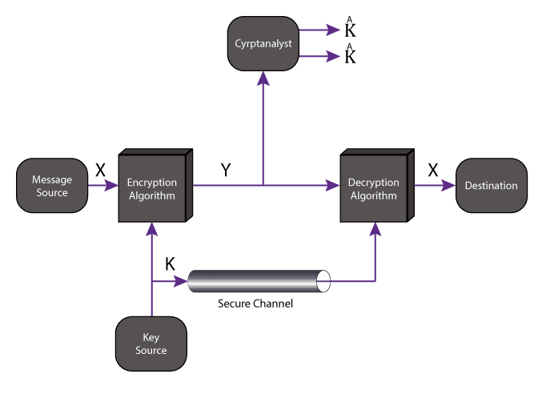
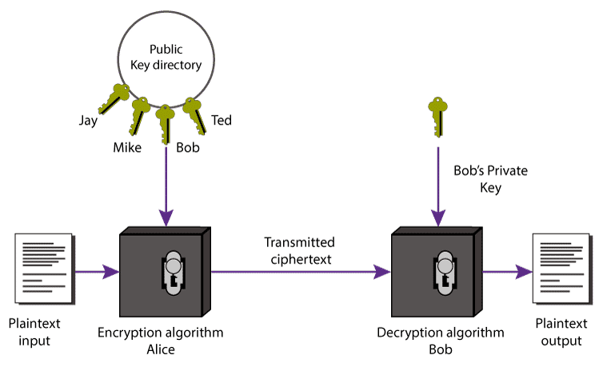

# Week 6
## Week 6 - Introduction to Cryptography - Cryptography Lectures slides 1 to 11
Link: https://learning.edx.org/course/course-v1:NYUx+CYB.ISP.2+3T2020/block-v1:NYUx+CYB.ISP.2+3T2020+type@sequential+block@07a8aed3b2434f4794c993e035bdacf8/block-v1:NYUx+CYB.ISP.2+3T2020+type@vertical+block@f71299fd07984c08b37fa56551e4375d

### Introduction
**Cryptography**: studie van wiskundige technieken om verschillende doelen in informatiebeveiliging te bereiken

#### Closed Design (as in military communication during the World War I/II)
- Algoritme is geheim
- Niet veilig, kan niet gecontroleerd/geaudit worden

#### Open Design (Kerckhoffs' principle)
- Algoritme is publiek
- Algoritme gebruikt een geheime key (secret input)
- Iedereen kan algoritme controleren/auditen

#### Brute Force Attacks: Key Recovery
- Attacker heeft message in plaintext en ciphertext
- Attacker overloopt alle mogelijke keys om zo die van target te acherhalen
- Voorkomen door grote key space (= aantal mogelijk keys), evolueert met de tijd. (Focus ligt op beveiligen van de recente toekomst)

### Symmetric/Private Key
- Sender en receiver delen een **gemeenschappelijk secret key**
- **Key** moet **gedeeld** worden via **beveiligd kanaal**!
- Pro: Efficient
- Con: Key verdeling is groot probleem (*N users vraagt N² keys*)
- Hoofdfuncties:
    - Key Generation algorithm `KeyGen(L) -> K`
    - Encryption algorithm `Enc(K,M) -> C`
    - Decryption algorithm `Dec(K,C) -> M`

*K: key, L: key lengte, M: message, C: cyphertext*

#### Caesar Cipher (Shift Cipher)
- Symmetric Key algoritme
- Elke letter in vervangen volgens op voorhand afgesproken verschuiving
- Key is hier nummer van verschuivingen

Encryption: `Ci = E(Pi ) = Pi + K (mod 26)`

Decryption: `Pi = D(Ci ) = Ci - K (mod 26)`

*Pi: i'de letter in plaintext, Ci: i'de letter in cyphertext*

### Private Key Encryption
#### DES (Data Encryption Standard)
- Werd vroeger gebruikt
- Makkelijk te brute forcen (zelfs speciale hardware voor)

#### Triple DES
- Veiligere variant van DES
- Voert DES 3x uit
- Keys vormen samen 168-bit lange key

Encryption: `C = Enc(K3, Enc(K2, Enc(K1, P)))`

Decryption: `P = Dec(K1, Dec(K2, Dec(K3, C)))`

#### AES (Advanced Encrytion Standard)
- Wordt nu gebruikt
- Doorstaat de tand des tijds tot nu toe zeer goed

#### Symmetric/Private key Ciphers and their applications (Relevant?)
- PGP
- Password hashing
- Bluetooth

### Asymmetric of Public key Cryptography
- Elke user heeft 2 keys
    - **Public (encryption) key** (om te delen)
    - **Private (decryption) key** (geheim)
- Veel grotere key space nodig (> 2048 bits), want aantal grote priem getal is klein
- Pro: **Geen beveild kanaal** nodig voor delen key
- Con: **Trager** dan symmetric cryptography
- Hoofdfuncties:
    - Key Generation algorithm `Keygen(L) -> Kpub, Kpriv`
    - Encryption algorithm `Enc(Kpub, M) -> C`
    - Decryption algorithm `Dec(Kpriv, C) -> M`

*Kpub: public key, Kpriv: private key, L: key lengte, M: message, C: cyphertext*

*Moet enorm moeilijk zijn om private key te berekenen via public key!*

### Digital Signatures
- Asymmetric keys "omgekeerd" gebruiken
- **Encrypt met private key, decrypt met public key** (mogelijk door wiskunde eigenschappen)
- Enkel user heeft toegang tot z'n eigen private key dus garantie dat message van hem komt
- Gebeurt in praktijk anders omdat dit traag zou zijn voor grote messages

Encryption: `C = Enc(Kpriv_bob, M)`

Decryption: `M = Dec(Kpub_bob, C)`